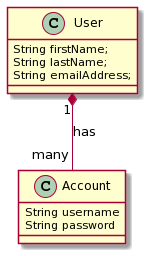
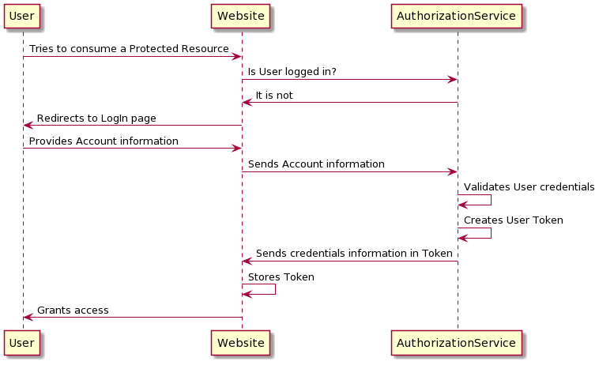

# **Authorization Service Design Document**

## **Glossary of Terms**

| Term  | Definition                                                                            |
|-------|---------------------------------------------------------------------------------------|
| AuthZ | Authorization. The process of knowing whether a User has access to a Resource or not. |
| AuthN | Authentication. The process of knowing whether someone is the one claiming to be.     |
| RPC   | Remote Procedure Calls                                                                |
| gRPC  | Google's RPC Framework                                                                |
| AuthX | The process of doing either AuthN or AuthZ                                            |
| VPC   | Virtual Private Cloud. It is a small Cloud that holds a Service or a Set of Services  |
| ALB   | Application Load Balancer                                                             |
| JWT   | JSON WebToken                                                                         |

## **Overview**

The **AuthorizationService** will be used in order to perform AuthX to Users. 

Both **Users** and __Services__ will be able to connect into this System and be able to validate a token returned by the System in order to fetch the privileges of a given User.

### **Problem Statement**

Currently we're building a set of **MicroServices** that connects between each other in order to fetch data from one service and move into another.

These Services are the **backing core** of a Website that lies in the open internet. Currently there's is no way of performing an AuthX at any given level, so it is highly likely that data might corrupted if someone intercepts the network connections and started acting as a User.

### **Business Justification**

Business wants to protect their data and also be able to analyze who is performing what operation on what resource. By having this project we're going to start creating a new layer of AuthX in our space. A layer that is going to be independent from the overall system's architecture. So anyone regardless from where this _User_ comes from can onboard with our Service. We also strive to create a multi-tenant AuthX that can be connected to and from several services in order to AuthZ or AuthN any given User.

### **In scope**

The folllowing Items are in Scope for the Phase-0 of this project:

* User CRUD
  * Have the ability to Create, Read, Update and Delete a User.
  * Deletion will be handled by making a User inactive (soft-delete) rather than deleting the actual record from the Database.
* User AuthN
  * The System should be able to store the Users password and apply a mechanism for Encrypting the password.
  * The System should be able to receive the password in plain-text and look-up if the provided credentials are valid or not.
  * The System will block a User's attempt to login after X numbers of attempts.
* User AuthZ
  * The System should be able to provide different levels of access granularity to a given User
    * View / ReadOnly: Only has access for Viewing Data
    * Edit: Can **Edit** only a given Resource, User won't be able to **Delete** or **Create**.
    * Create: Users will be able to **only** create a new given Resource.
    * Delete: Users will be able to **only** delete a given Resource.
    * Admin: User has all privileges mentioned before.
  * The System will be able to return a Token that will contain all the Information of a given User.
    * The System will also be able to Refresh a Token at any given period of Time.
* Multi-Tenancy: Several Apps/Services will be able to live and connect to this.

### **Out of Scope**

The following Items are out of Scope for this Document:

* Ability to create new Resources via a Dashboard or CLI.
* Granularity at Resource Level

# **Design**

The following diagram depicts what is the proposed System Architecture:

As we can see, the **AuthorizationService** will live in its own VPC and will only connect to a RDS Database (SQL Database). 

Any Service that wants to onboard/use this AuthX Service will have to communicate into it using its ALB which is Heroku.

## **User Management**

This System should also be able to manage/handle the creation and setup of Users. This means that Users will have to be onboarded within this System in order to get valid credentials in order to navigate through a given Application.

Simple User management will be used for this Phase.

How long will the password be? That is not meant to be resolved as part of this design document neither does what kind of protection we should use in the password.

It is worth to mention that this _User management_ is for the Users that will be _managing_ a whole Application not the Users that will be _consuming_ an Application.

## AuthN Workflow

Our System should be able to handle the **authentication** (AuthN) of our Users. This way, whoever wants to validate if a given **User** belongs to a System needs to call our Service in order for this Service to return a set of credentials provided the User exist.

Once a User has been authenticated the System will return a **Bearer Token** that will be used as part of the authorization strategy (see below).

This is the preferred/suggested workflow that consumers should have in order to consume this Service.

Take into consideration that up to this point we're not yet talking about `Authorization`, this process will be later explained.

When a User wants to log into our Website it will call the `AuthorizationService` and the passed credentials will live in the requests's Header, if any credential information is found within the `Bearer Token` then the User is _logged in_ otherwise the Service will assume the User is not logged in and no further operations should be done in the System. 

Once the User has been authenticated correctly, a special Token will be generated by the User and this one will be used for `Authorization` in later stages.

## AuthZ Workflow

The **Authorization** (AuthZ from now on) Workflow is the one that will take care of giving _access_ to a requesting User.

The AuthZ workflow can be done in two parts: 

* Authorization can take place at every request level (Making calls to the AuthService after every call)
* Store the most important information in a Token and have all the other Services to implement a _generic_ RouteHandler.

### **Authorization per request**

Authorization at each request might prove to be handy but this will create a bottle neck when having several or hundreds services calling this Service.

We could reduce this risk by making just specific calls to the `AuthorizationService` instead of making a call to it every time a new request hits a Service whih needs authorization.

### **Input most important information in the Token**

We could also add the most important information and have the Token _claim_ this. Other services could just check for the Token and validate if such claim can be used in a protected service and if so, then just make the request pass and grant access.

By doing this we can stop calling the AuthZ server every time and just have the correct type of data in the Token and thus reducing the possible bottlenecks.

My proposal is to write the most relevant information into the returned Token and have each Service valdiate the provided values in the Token to assert the authorization of a given User.

## MultiTenancy

We're expecting to have Users to onboard into the System hence we need to make sure that each User can have its own **application** and that it won't collide with other **applications**. In order to do this, we need to create an object that will _model_ an App's structure and will have all the required fields for an App to live.

Take into consideration that for this Phase0 we won't be creating an special User Interface so Users can manually onboard and have everything automated, for this P0 we're going to add the support for User to Apps and manually install an Application to leverage the System.

# **System's Default Values**

It is really important to clarify something: Since we're not going to have a new Website for handling the `scopes` and `claims` for any given `Identity` we need to set defaults ones. My proposal is to have just four simple claims: `read`, `create`, `delete`, `update`. These claims could be grouped into a single one named `admin`. Every initial service that onboard with us will have to check for these five claims before performing an operation.

Initially we won't handle any scopes but we're preparing everything for Phase-1. Such phase will include a module in were we will be able to create/edit scopes at any level of granularity.

# **Overall Application Model**

The proposed Application model is this:

Let's proceed to explain each piece of this diagram:

`AppUser`:

When Users are onboarded into our platform/service they will be able to create they our ApplicationService that will serve them to create several applicaations.

What's the reasoning behind this? If we assume that, potentially, a User could have several stages in its Application Deployment Pippeline; such as Alpha, Beta, Gamma dn Prod, it will require a different ApplicationId per stage. By having a single AppUser have several Applications we could alleviate this problem.

`Aplication`:

The Applicaton object is the one that will isolate the data from one userbase to another. This means, that Users, Accounts, Permissions will be seggregated based off the `Application`, hence two Apps won't share any set of data e.i. `Scopes`, `Entity`, `Accounts` and and so on.

`Scope`:

A scope defines a _piece_ of information. We can see the _scope_ as a different section/piece of the Website. For example we could say that within a website there's a **product** section, therefore the scope in this case can be **product**.

Within a scope we can see there is a _claims_ field, a _claim_ will identify an specific action within a scope.

`Claim`:

In Authorization and Authentication a **claim** is merely a fact about something. The AuthServer is _claiming_ that someone can do **something**. There're several kind of `claims` within the AuthX world. However, we won't make use of any reserved one but the email one; other _claims_ will be customized by each `AppUser` so they can decided how to handle permissions.

`Identity`:

This object identifies a _subject_ or someone in our System. A given `Application` can have **X** number of `Identities` and such can't be tied to several `Application`s.

Given these four concepts explained so far, the system will be able to create the following statements:

> Andrew is trying to log into WorkByCloud

In this case we can see that _someone_ is saying that its `Identity` is **Andrea** and for this case it provides its credentials. The Service will then validate such credentials and decide whether that person is the one who claims to be. Should this process be successfull then the System will return the User's `Identity`. This identity will be one that is going to be used in External Services to know if such `Identity` has access or not to something.

> WorkByCloud states that Andrew can read products

The second statement we have a little more complex situation:

| Asserting Party | Subject | Claims     | Scope |
|-----------------|---------|------------|-------|
| WorkByCloud     | Andrew  | read       | products

In this case we can see that our app (WorkByCloud) says that an Identity (Andrew) can read (claim) products (scope). Given all this, Systems onboarded with the AuthService will be able to validate the provided `Identity` and interact with their own Systems.

# **Technical Design**

As we have discussed previously the main goal of this Service is to create an `Authorization`, `Authentication` and `Identity` Service (potentially we should change the name of the Service to `AAIS`). While there are so many implementations on the Internet about how to do this, our System will follow the [OAuth2.0](https://oauth.net/2/) standard.

As we all know since this is an standard we need to be compliant to it. At the end of this Phase the Service should be able to be a compliant OAuth2.0 Server where anyone can be onboarded into it and start consuming data information from it.

`JWT`  (JSON WebToken) will be used as both the access and refresh tokens. This is one of the standards for transmitting safe communication between the Auth Server and the Applications.

For this initial phase we are going to use an SQL (RDS) Database for storting and handling all the Information. While this might not be the correct solution - due to data changing over time and no analytics required - it is mandated to stick with **Free plans** when deploying to the Cloud Platform.

One thing that is quite important for this: Before the project was initiated the main goal was to create an AuthX Framework and have all the other services connect into it, this connection was going to be made using gRPC (Google's RPC Framework) and have all the other Services call us via this method. This, as a matter of fact, can't be achieved by traditional means since the OAuth Specification is for communication via WebApp's using REST API's instead of procedures (classic functions). While this is a limitation of the OAuth2.0 standard, there's no reason why we can't implement gRCP in the other Services and add an _authenthication layer_ on top of each Service to validate the Token. How do to this and why we should do it is out of scope for this document.

One of the most confusing parts of these architecture/schema is how the data validation handling will occur. Therefore, how data exchanging; User creation and managament; and permissions will occur will be explained in three different diagrams.

**User creation**:

**User Management (Permission Assignment)**:

Up to this we have seen how Users are going to interact with both our Service and Websites. We have also seen how the porential _AuthWebsite_ could be used as **Hub** to handle all the permissions and scopes for a given Application.

**Tokens Validation**

However, one of the most important parts of all this process is yet to be described. How are we going to perform the validation?

![https://www.plantuml.com/plantuml/uml/bP91RzH038Nl-olU3JZG7x07r9Mee58b92Au8k_4IKmJEnexXVBhIIUhQgE8NN5BF7xFtvDzwq4vfg7VtTUi8V6CznzmqCCuzf8en7IF1slVEEvrjwgNnYcwYlEJ9DwZie5D6UA8_2pQ8WozjH2zsPrrReGFPe-EQGGfNZ6Ev5p3cWRHCLBcya2zRxtMjD-SCngRjBx1PyuBpsn1iygo_2bjFy8UUHDeurM5PVOYNHGG1Q5YTx6j_9L-Zq-PDFmblbpiE_WSlR6CmpaUmZ1odki3IF5b_bxgfZXoHtq3QzQmbnPuWfbT1YdaVcMLTxzJHzgkeXTAKb1Ax7vUGojFhF1a8rzPpbUEAQklJAvkuJlrKbEmBoFyFmIf9naSRycTyykZWuusHRc8QZh-v1Jlhlfzv2GrEtvrFEiomj1cqZZ5W6Me1SB-SS4d2j9wIN3f8EwaZ9Z_XOjpcUIdKRjRrdeQ-hy0](images/ValidationDiagram.png)

As we can see each Application that is onboarded with us will to make at least two requests to our Service. One for logging the user in and the second one just requesting the kind of access such `Identity` has for a given scope. Don't forget that an scope can be a section of a WebApp e.i `https://my-wonderful-app.com/products` (scope=`products`).

# **A Two-Problem-To-Solve Project**

As we have read throughout this design document, the `AuthorizationService` will **not** only be for `Authorization` but also for `UserManaget` (aka. `UsersService`). This is something really important to call out because we also want to have the code divided into two different segments. 

My main idea is to have the `UsersService` portion as if it were its very own _Application_ (A Consumer of AuthService). By doing so I foresee the `UsersService` as the very first consumer and dog-feeder of the original `AuthService`. However, we won't sacriffice this split if we don't have enough time. Just something to call out so engineers can be aware of it.

# **A New Website**

As we have read throughout this document, it might seem **right** to create a new Website for managing the Users. While this is not wrong we currently lack the time and headcount to do so. Furthermore we're lagging behind more important business needs and hence we need just to build the basic infrastructure for an AuthServer and we will plug-in several new components as they will rise.

# **Risks**

* Failure of this project could lead to potential losses as anyone in the Internet will be able to connect to a Service and tamper with the data.
* Not having permissions as well could create data leaks as anyone logged into a System will be able to play around with the data.
* Failure to be compliant with the OAuth 2.0 spec will reduce the ability of our System to connect to other Identity providers such as Google, Twitter, etc.

# **F.A.Q.**

* You mentioned something about a 2-problem-to-solve project. How are you planning to tackle in terms of code?
  * My idea is to create two main packages. Let's say we have a domain: `com.mchan.bakery` since we're building two different services we would create two different packages as well such as: `com.mchan.bakery.users` and `com.mchan.bakery.auth`. On top of that we will add Linting rules so no one can import a member from the main packages. e.i classes under `com.mchan.bakery.auth` will fail to compile if they import classes from `com.mchan.bakery.auth`.
* I don't quite understand who is going to do what. Do you have a simpler example?
  * Yeah. I know that feeling. The whole process we described can be explaned in simpler words. Let's place the same questions stated before as three simple questions:
    * Who are you?
      * User creation is just that. Creating _someone_ so it can be identified later.
    * What can someone do?
      * You, as an owner of an Application, will have the privilege to grant permissions to Users. In simpler words you can say that *Mariana* (SystemOwner) says that *Jessica* (User) can only **view** (claim) **accounts** (scope).
    * Okay. You're saying that the `AppOwner` will grant such permissions. But it is still not quite clear. Who is going to validate such permissions? Do I need to call the `AuthService` everytime I want to do anything in my Service?
      * No. The `AuthService` should be called at least once per scope. This means, that you can structure your Application as `Routes` and have them as `scopes` in the `AuthService`. A good sample could be that your Application has either `two services` or `two main resources` one is `yourapp.com/resource1/` and the second one is `yourapp.com/resource2/`. If you're trying to access `resource1` you would request an Scope of `resource1` to view the Users permissions on such Resource and the calling App/Service should be the one deciding to grant access or not.
* Are we going to build a new website?
  * No. We're not going to build a new website for this phase. However, it is highly likely that will create a new Website in where any given AppUser can create its own `scope` and provide `claims` for such and finally assign it to a any given User in the Database. This is part of P1.

# **Resources**

* [OAuth 2.0 Specification](https://oauth.net/2/)
* [Scopes and Claims Explained](https://curity.io/resources/learn/scopes-claims-tokens-and-all-the-things-in-between/)
* [JWT Signatures](https://www.pingidentity.com/en/company/blog/posts/2019/jwt-security-nobody-talks-about.html)
* [OAuth 2.0 Simplified (Digital Version)](https://www.oauth.com/oauth2-servers/background/)