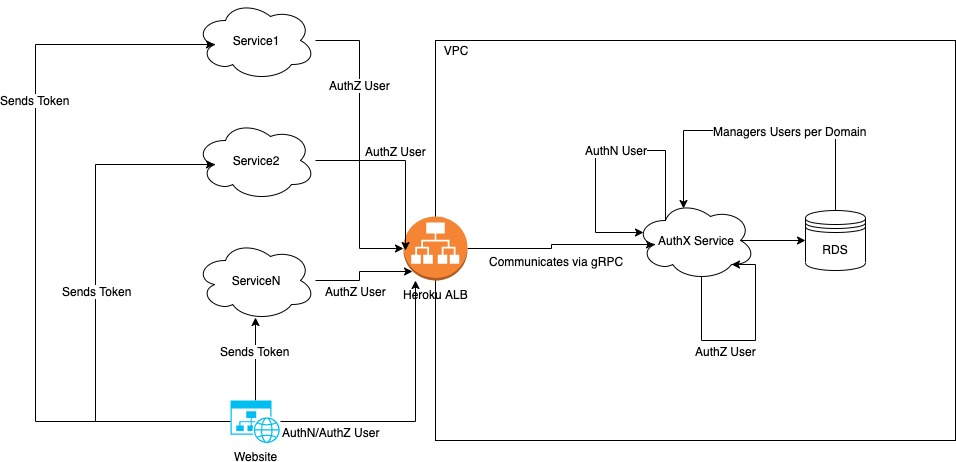

# **Authorization Service Design Document**

## **Glossary of Terms**

| Term  | Definition                                                                            |
|-------|---------------------------------------------------------------------------------------|
| AuthZ | Authorization. The process of knowing whether a User has access to a Resource or not. |
| AuthN | Authentication. The process of knowing whether someone is the one claiming to be.     |
| RPC   | Remote Procedure Calls                                                                |
| gRPC  | Google's RPC Framework                                                                |
| AuthX | The process of doing either AuthN or AuthZ                                            |
| VPC   | Virtual Private Cloud. It is a small Cloud that holds a Service or a Set of Services  |
| ALB   | Application Load Balancer                                                             |

## **Overview**

The **AuthorizationService** will be used in order to perform AuthX to Users. 

Both **Users** and __Services__ will be able to connect into this System and be able to validate a token returned by the System in order to fetch the privileges of a given User.

### **Problem Statement**

Currently we're building a set of **MicroServices** that connects between each other in order to fetch data from one service and move into another.

These Services are the **backing core** of a Website that lies in the open internet. Currently there's is no way of performing an AuthX at any given level, so it is highly likely that will might corrupted if someone intercepted the network connections and started acting as a User.

### **Business Justification**

Business wants to protect their data and also be able to analyze who is performing what operation on what resource. By having this project we're going to start creating a new layer of AuthX in our Services, which will be later used by other common layers of the Service EcoSystems.

The main goal is to create a multi-tenant AuthX that can be connected to and from several services in order to AuthZ or AuthN any given User.

### **In scope**

The folllowing Items are in Scope for the Phase-0 of this project:

* User CRUD
  * Have the ability to Create, Read, Update and Delete a User.
  * Deletion will be handled by making a User inactive (soft-delete) rather than deleting the actual record from the Database.
* User AuthN
  * The System should be able to store the Users password and apply a mechanism for Encrypting the password.
  * The System should be able to receive the password in plain-text and look-up if the provided credentials are valid or not.
  * The System will block a User's attempt to login after X numbers of attempts.
* User AuthZ
  * The System should be able to provide different levels of access granularity to a given User
    * View / ReadOnly: Only has access for Viewing Data
    * Edit: Can **Edit** only a given Resource, User won't be able to **Delete** or **Create**.
    * Create: Users will be able to **only** create a new given Resource.
    * Delete: Users will be able to **only** delete a given Resource.
    * Admin: User has all privileges mentioned before.
  * The System will be able to return a Token that will contain all the Information of a given User.
    * The System will also be able to Refresh a Token at any given period of Time.
* Multi-Tenancy: Several Apps/Services will be able to live and connect to this.

### **Out of Scope**

The following Items are out of Scope for this Document:

* Ability to create new Resources via a Dashboard or CLI.
* Granularity at Resource Level

# **Design**

The following diagram depicts what is the proposed System Architecture:

As we can see, the **AuthorizationService** will live in its own VPC and will only connect to a RDS Database (SQL Database). 

Any Service that wants to onboard/use this AuthX Service will have to communicate into it using its ALB which is Heroku.

## User Management

* ToDo: Define User

## AuthN Workflow

* ToDo: Define AuthN Workflow

## AuthZ Workflow

* ToDo: Define AuthZ Workflow

## MultiTenancy

* Todo: Define how this feature will Work.

# **Risks**

